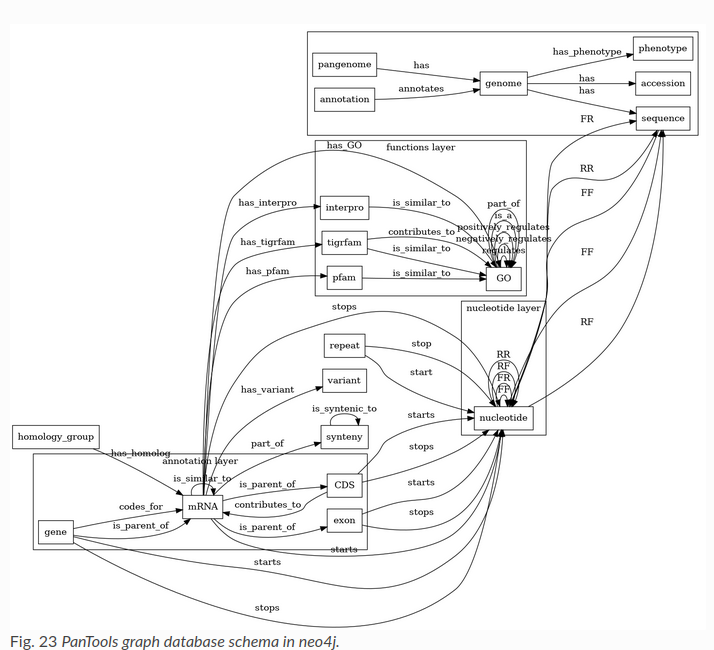

# Transportation algorithm
**Functionality** \

****

**Motivation** \
The below program has been collected from the following github [repository](https://github.com/phenopolis/pheno4j/blob/master/src/main/java/com/graph/db/domain/output/GeneticVariantOutput.java).

The repo has an implementation for Genetic and phenotype data in JSON, csv and more which is translated to a graph DB. We extracted a class initialiser to showcase the imporatncy of correct typing from [here](https://github.com/phenopolis/pheno4j/blob/master/src/main/java/com/graph/db/domain/output/GeneticVariantOutput.java)

****
