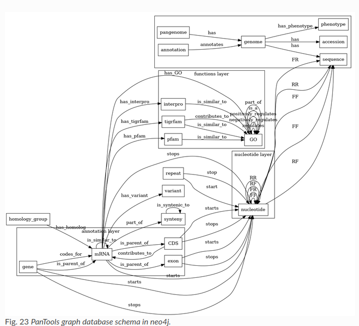

# Transportation algorithm
**Functionality** \

****

**Motivation** \
The below program has been collected from the following github [repository](https://github.com/Citegraph/citegraph/tree/main).

The repo shows an algorithm to collect the second hop references papers. The function is called _getCitationNetwork()_ and can be found [here](https://github.com/Citegraph/citegraph/blob/main/backend/src/main/java/io/citegraph/app/GraphController.java)

****
